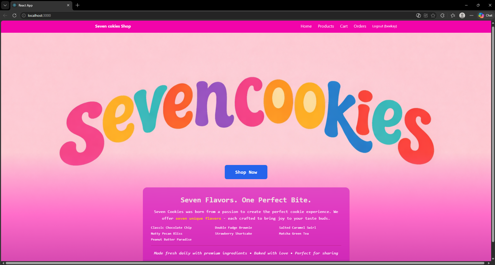
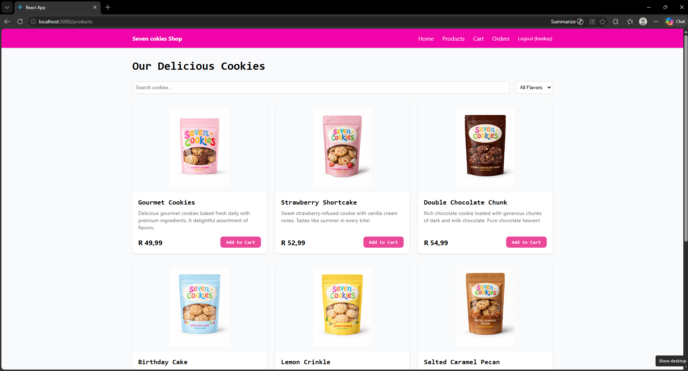
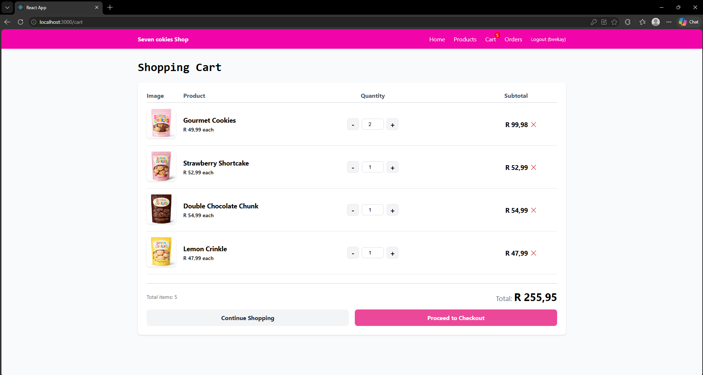
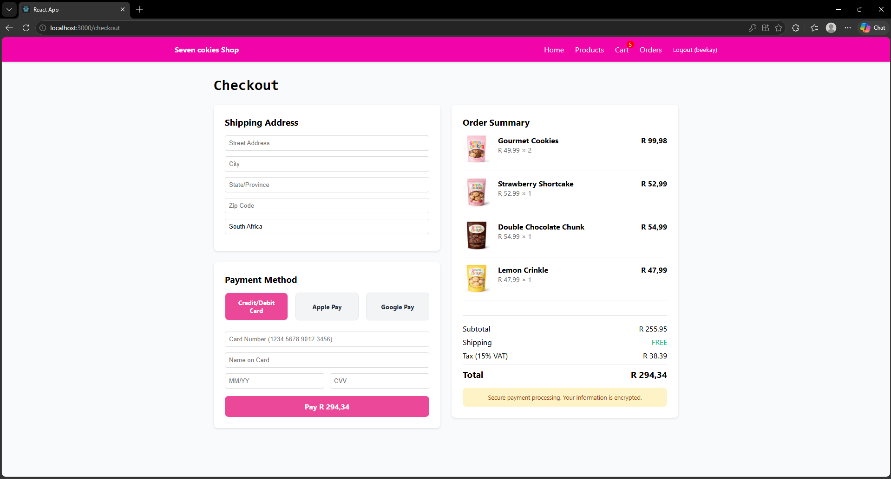
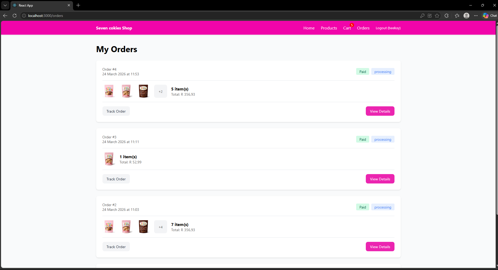
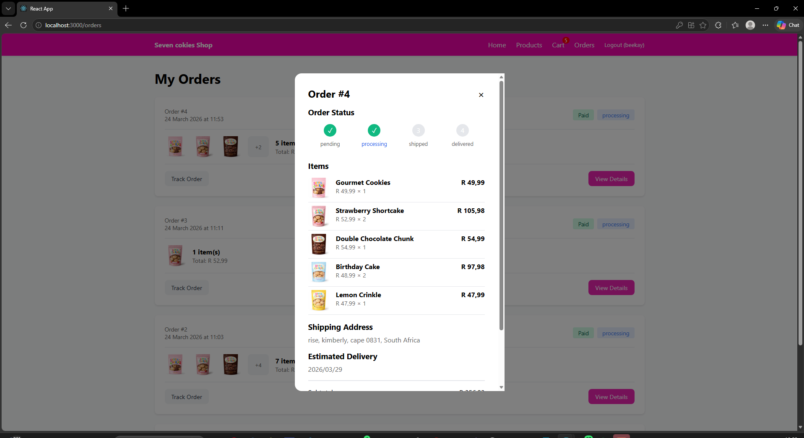
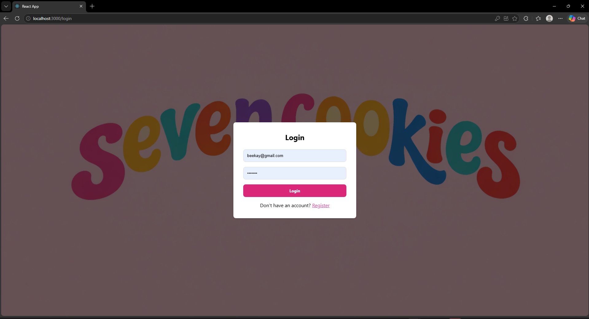

# SevenCookies 

A premium cookie e-commerce platform featuring seven delicious cookie flavors. This full-stack application provides a seamless online shopping experience with Django backend and modern frontend.

##  Screenshots

| Page | Screenshot |
|------|------------|
| Homepage |  |
| Products Page |  |
| Shopping Cart |  |
| Checkout Page |  |
| Orders Page |  |
| Order Tracking |  |
| Login Page |  |
## Project Structure

\\\
planetSeven/
├── backend/          # Django REST API
│   ├── manage.py
│   ├── requirements.txt
│   ├── api/          # API endpoints
│   ├── core/         # Core settings
│   └── products/     # Product management
└── frontend/         # React/Vue frontend
    ├── src/          # Source files
    ├── public/       # Static files
    └── package.json  # Dependencies
\\\

## Features

- **Product Catalog**: Browse seven premium cookie flavors
- **User Authentication**: Register, login, profile management
- **Shopping Cart**: Add/remove items, update quantities
- **Order Management**: Track orders, view history
- **Admin Dashboard**: Manage products, orders, users
- **Responsive Design**: Mobile-friendly interface

## Technology Stack

### Backend
- Django 5.x
- Django REST Framework
- SQLite3 / PostgreSQL
- JWT Authentication
- PayFast / Stripe Integration

### Frontend
- React / Vue.js
- Bootstrap 5 / Tailwind CSS
- Axios for API calls
- Context API / Redux

## Installation

### Prerequisites
- Python 3.8+
- Node.js 16+
- pip
- npm / yarn

### Backend Setup

1. Navigate to backend:
\\\ash
cd backend
\\\

2. Create virtual environment:
\\\ash
python -m venv venv
# Windows:
venv\Scripts\activate
# Mac/Linux:
source venv/bin/activate
\\\

3. Install dependencies:
\\\ash
pip install -r requirements.txt
\\\

4. Configure environment:
Create .env file:
\\\
SECRET_KEY=your-secret-key
DEBUG=True
DATABASE_URL=sqlite:///db.sqlite3
\\\

5. Run migrations:
\\\ash
python manage.py migrate
python manage.py createsuperuser
\\\

6. Start backend server:
\\\ash
python manage.py runserver
\\\

### Frontend Setup

1. Navigate to frontend:
\\\ash
cd ../frontend
\\\

2. Install dependencies:
\\\ash
npm install
\\\

3. Start development server:
\\\ash
npm start
\\\

4. Visit: http://localhost:3000

## API Endpoints

| Endpoint | Method | Description |
|----------|--------|-------------|
| /api/products/ | GET | List all products |
| /api/products/{id}/ | GET | Get product details |
| /api/cart/ | GET/POST | View/add to cart |
| /api/orders/ | GET/POST | View/create orders |
| /api/auth/register/ | POST | User registration |
| /api/auth/login/ | POST | User login |

## Deployment

### Backend (Heroku/PythonAnywhere)
\\\ash
cd backend
heroku create sevencookies-backend
git push heroku main
heroku run python manage.py migrate
\\\

### Frontend (Vercel/Netlify)
\\\ash
cd frontend
npm run build
# Deploy build folder to hosting service
\\\

## Author

**Maafrica Mokoena**
- Student Number: 20243380
- Sol Plaatje University
- GitHub: @mokoena837

## License

Academic project for Web Development coursework.
